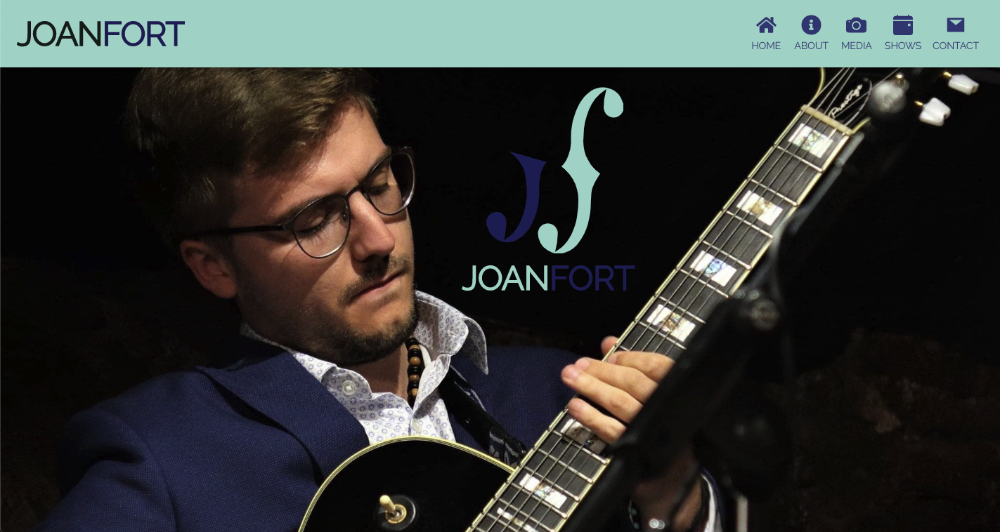
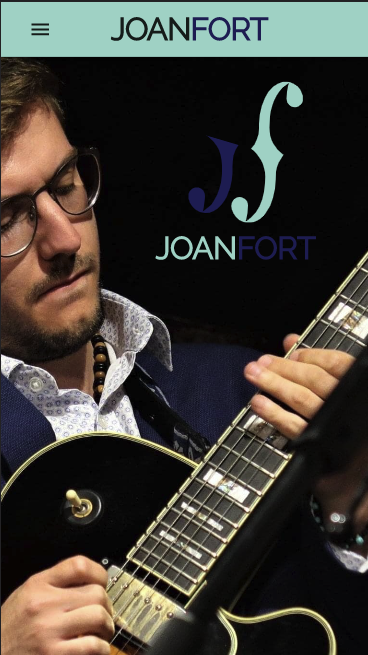

# josh-lee-and-family-website

</br>
<p align="center">
    
    
    
       
    
    
    
     
      
      
      
</p>

[](https://github.com/git/git-scm.com/blob/main/MIT-LICENSE.txt)

## Description

I created a fully-functional professional musician website for a client, incorporating various cutting-edge technologies such as React, JS, and MUI. To add a dynamic edge to the website, I integrated the Bands in Town API to enable the client to easily manage upcoming shows by adding or modifying events directly from their Bands in Town artist account. This eliminates the need for me to manually code events into the website, ensuring that the site stays up-to-date with the latest events.

## User Story

```
As a professional musician I want to view a slick, mobile first musician website where I can view my info such as Biography, Discography, downloadable EPK, media(such as videos, photos, and EPK), a schedule and contact information.
```

## Table of Contents

- [Usage](#usage)
- [Mobile View](#mobile-view)
- [Links](#links)
- [Technologies Used](#technologies-used)
- [License](#license)
- [Contributions](#contributions)
- [Questions](#questions)

## Usage



## Mobile View



## Links

- Netlify demo site link: (https://www.joshleeandthefamily.com)
- Github Repository URL: (https://github.com/CliffordMorin/josh-lee-and-family-website)

## Technologies Used

<p align="center">
    <a href="https://developer.mozilla.org/en-US/docs/Web/CSS"></a>
    <a href="https://www.javascript.com/"></a>
    <a href="https://reactjs.org/"></a>
     <a href="https://mui.com/"></a>
      <a href="https://reactrouter.com/web/guides/quick-start"></a>
      <a href="https://fontawesome.com/v5.15/how-to-use/on-the-web/using-with/react"></a>
</p>

## License

[](https://github.com/git/git-scm.com/blob/main/MIT-LICENSE.txt)

## Contributions

Fork, request, or contact me.

## Questions

[](https://github.com/CliffordMorin)
[](https://www.linkedin.com/in/clifford-morin-ma-129888a9/)

Feel free to reach me at cliffthedev@gmail.com with any question regarding this project!
